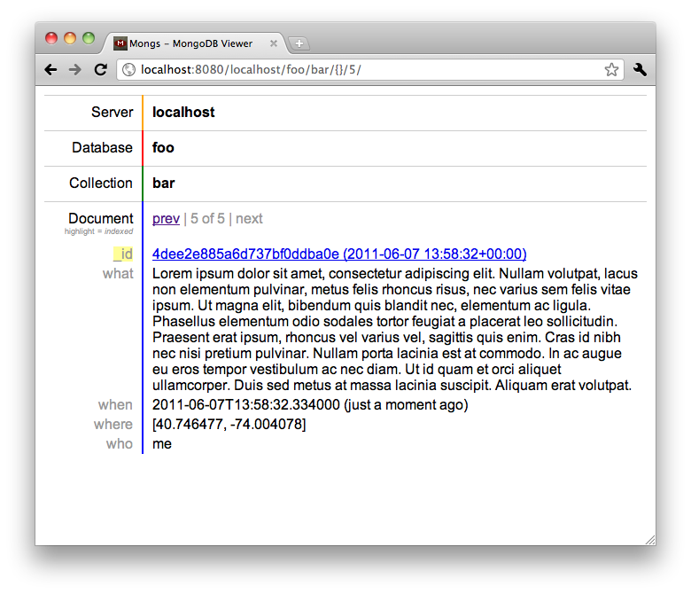

# Mongs

Mongs is a **web-based data browser** for <a
href="http://www.mongodb.org/">MongoDB</a>.



## Installation

```
$ git clone https://github.com/chadwhitacre/mongs.git
$ cd mongs
$ make run
Greetings, program! Now serving on http://0.0.0.0:29017/.
```

Now visit http://0.0.0.0:29017/. :-)

## Usage

Click to **browse**.

You can **query** using JSON expressions in the URL, where the `{}` is in the
above screenshot.

You can **sort** by adding a `"sort": [["field", -1]]` key/val to the `{}` in
the URL. It will be popped and the rest of the dict will simply be a
[PyMongo](https://api.mongodb.com/python/current/) query.

To add more **servers**, create (or link) a `servers.txt` file in the Mongs
distribution root with one server hostname per line, e.g.:

```
$ cat servers.txt
localhost
internal-1.mycorp
internal-2.mycorp
```


<h2>Development</h2>

Mongs is implemented in Python using the [Aspen](http://aspen.io/) web
framework.


<h2>Bonus Picture</h2>

Mongs is named after a dairy. Herewith, an old milk box repurposed to hold
computer cables, showing the Mong's Dairy logo:


<h2>Legal</h2>

Copyright &copy; Chad Whitacre and contributors. <a
href="http://www.opensource.org/licenses/mit-license.php">MIT</a>-licensed.
